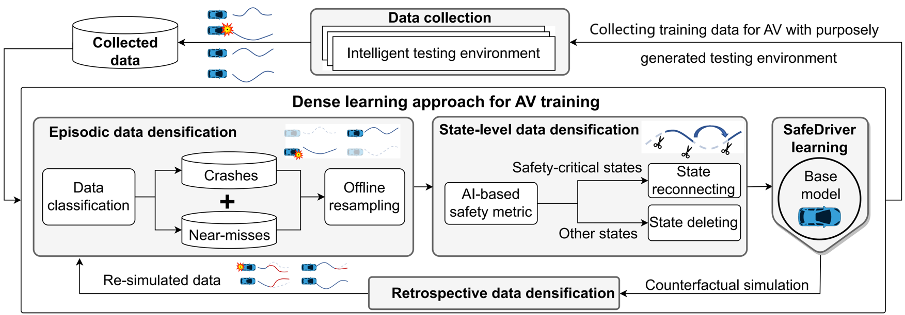

# Breaking through safety performance stagnation in autonomous vehicles with dense learning

## Table of Contents:
1. [Introduction of the Project](#introduction-of-the-project)
    - [Overview](#overview)
    - [Code Functionality](#code-functionality)
2. [System Requirements](#system-requirements)
    - [Hardware](#hardware)
    - [Software](#software)
3. [Getting Started](#getting-started)
    - [Installation](docs/installation.md)
    - [Data Collection/Evaluation](docs/data_collection_evaluation.md)
    - [Preparing Dataset](docs/prepare_dataset.md)
    - [Training](docs/training.md)
    - [Demonstration](docs/demonstration.md)
3. [License](#license)

<!-- ABOUT THE PROJECT -->
## Introduction of the Project

### Overview
In the realm of autonomous vehicles (AVs), the journey toward commercial viability has been met with enthusiasm but also challenged by the stringent need for safety standards that match or exceed human driver capabilities. A crucial hurdle in this area is the infrequency of critical safety events within complex driving environments, making it difficult to achieve and validate the required level of safety performance. 

We are excited to present a cutting-edge dense learning framework that concentrates on extracting the most from both failure experiences and instructive successful outcomes. As shown in the following figure, our dense learning strategy is characterized by selectively sampling data that maximally influence the policy gradient, while deliberately sidelining less informative data points. This targeted approach enriches the training dataset with highly relevant information, leading to a considerable reduction in learning variance while maintaining the integrity of unbiasedness. 

This repository is your gateway to the codebase for our dense learning methodology and showcases its capacity to elevate safety performance in AVs, as specifically illustrated within a simulated highway driving scenario.

### Code Functionality
The code's functionalities are shown in the following diagram.

> 1 core*hour denotes the simulation running on one CPU core (Intel Xeon Gold 6154 3.0GHz) for one hour.

## System Requirements

### Hardware
This code can run on a computer with the following hardware configuration:
- RAM: 32+ GB
- CPU: 8+ cores, 3.0+ GHz/core

It is highly recommended to run this code on a High-Performance Computing (HPC) cluster to reduce the time for data collection and training.

### Software
This code is developed and tested under
- Ubuntu 18.04 operating system
- Python 3.9.12

## Getting Started
- [Installation](docs/installation.md)
- [Data Collection/Evaluation](docs/data_collection_evaluation.md)
- [Preparing Dataset](docs/prepare_dataset.md)
- [Training](docs/training.md)
- [Demonstration](docs/demonstration.md)

## License
This code is licensed under the [PolyForm Noncommercial License 1.0.0](LICENSE).
