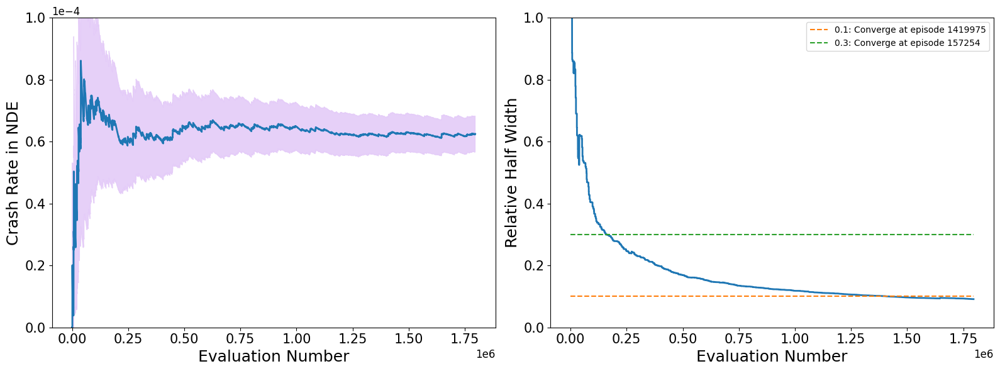
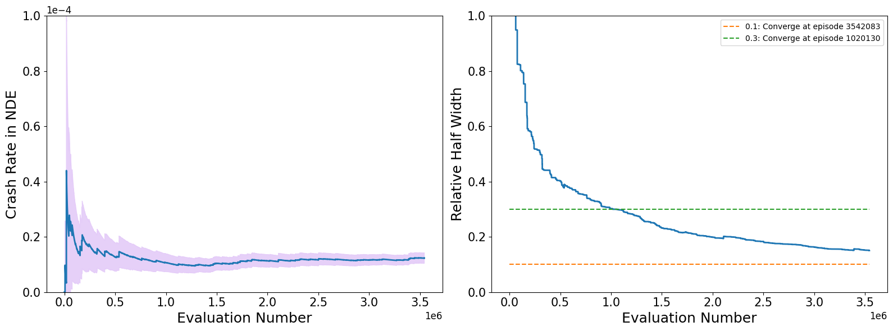

# Demonstration on Example Data
Since the whole training process is time-consuming, we provide all the data of one iteration initializing from the base AV model to prove the effectiveness of our methodology. 

## 1. Download the raw data
Please download the data from [this link](https://zenodo.org/records/12735037) and extract the zip file named "Example_Training_Iteration.zip" within the current workspace. The example data folder should have the following structure:
```
Dense-Learning-for-AV-Training/Example_Training_Iteration/
|__testing_results/
|_____Experiment-test_basemodel_2024-01-17/ # data collection of the base AV model
|_____Experiment-test_densemodel_ckpt394_2024-01-18/ # data collection of the trained AV model
|__training_results/
|_____test_training/ # training results for this iteration
|_____densemodel_fdm369_dm394.pt
```

If you want to analyze the evaluation results, please go to the [Jupyter Notebook](../data_analysis/crash_rate_analysis.ipynb) and modify the variables named "**root_folder**" and "**experiment_folder**" in the first cell. Then, please press the "Run All" button to get the estimated crash rate in NDE for the base AV model, which is equal to 6.25e-05. The evaluation results should look like this:

 

The left figure shows the estimated crash rate in NDE, and the right figure shows the convergence process of the evaluation.

## 2. Prepare the training dataset
Please follow the instructions in [**Preparing Dataset**](prepare_dataset.md) to process the training data for SafeDriver. The processing results of the example data are already stored in the folder "Dense-Learning-for-AV-Training/Example_Training_Iteration/testing_results/Experiment-test_basemodel_2024-01-17/densified_exps". In summary, we collect 1141 crashes and 664 near-miss events for the training.

## 3. Train the SafeDriver
If you want to train the SafeDriver using the example data, please follow the instructions in [**Training SafeDriver**](training.md). The training results are already stored in the folder "Dense-Learning-for-AV-Training/Example_Training_Iteration/training_results/test_training".

We export the trained SafeDriver model as a PyTorch model and store it as "Dense-Learning-for-AV-Training/Example_Training_Iteration/training_results/densemodel_fdm369_dm394.pt".

## 4. Evaluate the SafeDriver
Finally, we evaluate the safety performance of the trained SafeDriver and collect data for the next training iteration. The evaluation results are stored in the folder "Dense-Learning-for-AV-Training/Example_Training_Iteration/testing_results/Experiment-test_densemodel_ckpt394_2024-01-18". The estimated crash rate in NDE for the SafeDriver is 1.24e-05. The evaluation results should look like this:



<- Last Page: [Training](training.md)